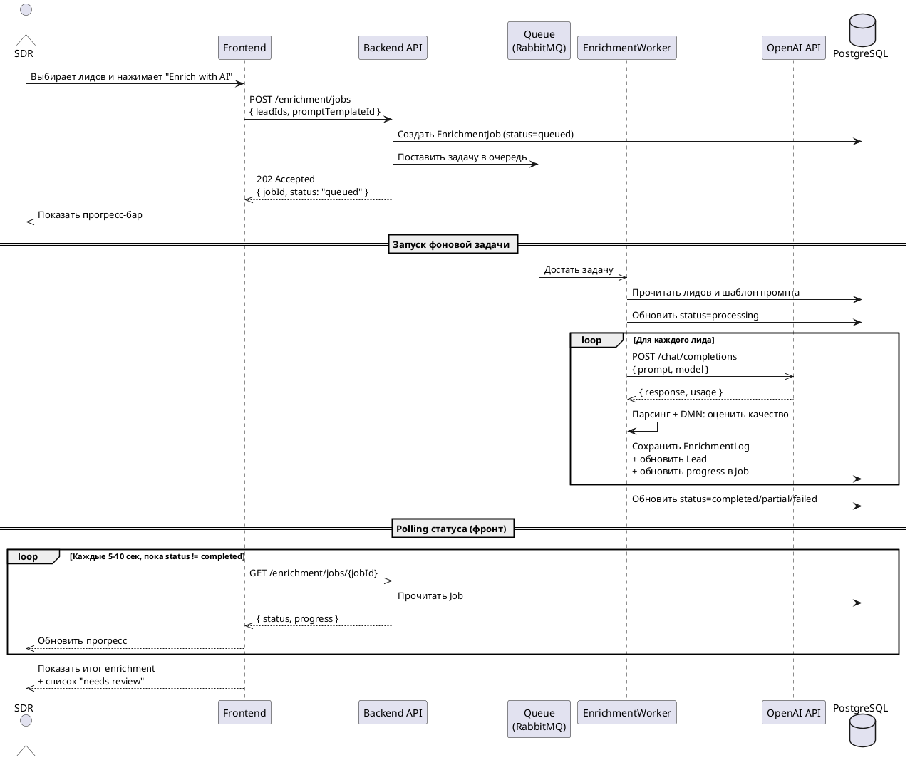

# Sequence диаграмма: AI Enrichment

Диаграмма показывает асинхронное взаимодействие при запуске enrichment: фронт получает `202 Accepted` сразу, бэкенд ставит задачу в очередь, фронт опрашивает статус через polling каждые 5–10 секунд.

## Ключевые моменты

- **`202 Accepted`** вместо `200 OK` — фронт сразу получает ответ, фактическая работа идёт асинхронно.
- **Очередь** (RabbitMQ или эквивалент) разделяет API и worker — UI не зависит от скорости OpenAI.
- **Polling** каждые 5–10 секунд — выполняет NFR-02 ("Enrichment без зависания интерфейса").
- **DMN-оценка качества** на стороне worker — определяет, нужен ли human review (см. [DMN](../03-architecture/dmn)).
