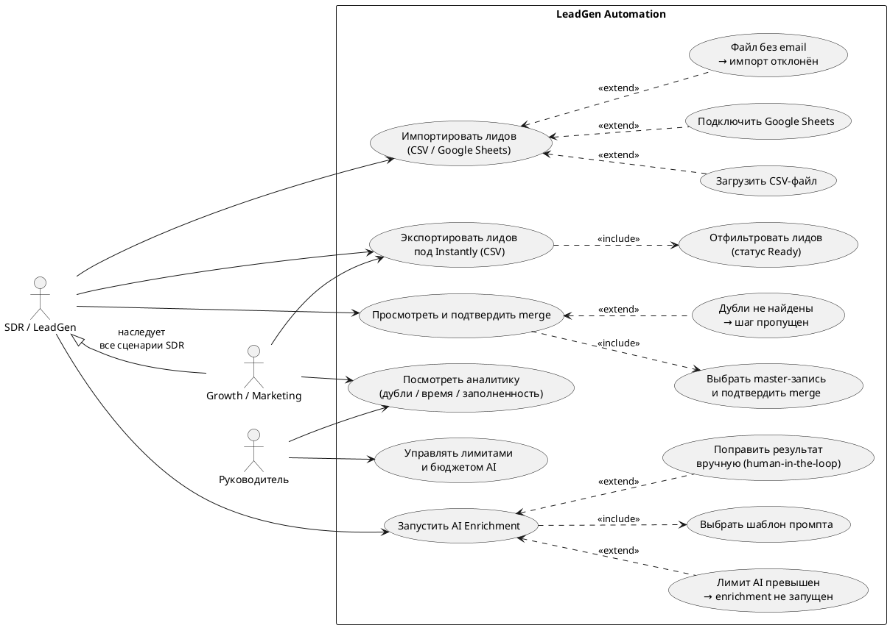

# Use Case диаграмма

Диаграмма построена на основе use cases UC-FR-01 — UC-FR-05. Включает три типа акторов (SDR/LeadGen, Growth/Marketing, Руководитель), их ассоциации с use cases, отношения `<<include>>` и `<<extend>>`, наследование между Growth и SDR.

## Описание

- **SDR / LeadGen** — основной актор, выполняет все ключевые сценарии: импорт, дедупликация, enrichment, экспорт.
- **Growth / Marketing** — наследует все сценарии SDR + смотрит аналитику.
- **Руководитель** — управляет аналитикой и лимитами AI.

## Отношения

- `<<include>>` — обязательная часть use case (например, выбор master-записи всегда часть merge).
- `<<extend>>` — расширение, выполняется при определённом условии (например, "лимит AI превышен" — отдельный поток исключения).
