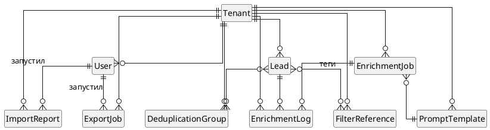

# Уровень 1: Концептуальная модель

Только сущности и связи. Атрибутов нет — уровень для обсуждения с бизнесом. Сущности определены из use cases UC-FR-01 — UC-FR-05.

## Ключевые связи

- **Tenant → всё остальное (1:N).** Изоляция данных по tenant (NFR-08).
- **Lead ↔ DeduplicationGroup (M:N).** Один лид может быть в нескольких группах дублей, одна группа содержит несколько лидов.
- **Lead ↔ FilterReference (M:N через теги).** Один лид может иметь несколько тегов.
- **EnrichmentJob → EnrichmentLog (1:N).** Одна задача = много логов (по одному на лида).
- **EnrichmentLog → Lead (N:1).** Каждый лог привязан к конкретному лиду.
- **EnrichmentJob → PromptTemplate (N:1).** Задача использует один шаблон промпта.

## Диаграмма

## Источник в PlantUML

Файл [`/diagrams/erd_1_conceptual.puml`](https://github.com/Nik-ari-ai/leadgen-automation-docs/blob/main/my-website/diagrams/erd_1_conceptual.puml).
