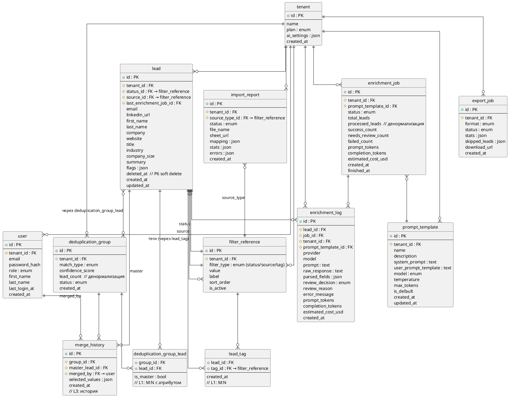

# Уровень 2: Логическая модель

С атрибутами, ключами и связями. Применены стандартные паттерны нормализации.

## Применённые паттерны

### L1 — M:N с атрибутом
- `deduplication_group_lead` — связь DeduplicationGroup ↔ Lead с атрибутом `is_master` (какой лид — master при merge).
- `lead_tag` — связь Lead ↔ FilterReference (для тегов через M:N).

### L2 — Справочник
`filter_reference` — справочник значений для фильтров (статусы, источники, теги). `lead.status_id` и `lead.source_id` — FK на этот справочник. Причина: новые значения добавляются руководителем через интерфейс без миграции схемы (INSERT вместо ALTER TYPE).

### L3 — История
`merge_history` — история merge-операций (FK на group, master_lead, merged_by user). Нужна для UC-FR-03 ("сохраняет историю merge").

### P6 — Soft delete
`Lead.deleted_at` — мягкое удаление. Физически не удаляем — нужно для GDPR (NFR-07). Merged-записи тоже помечаются `deleted_at`.

## Что enum, а что справочник

| Поле | Решение | Почему |
|---|---|---|
| `lead.status` | **Справочник** | Новые значения добавляются через UI без деплоя |
| `lead.source` | **Справочник** | То же самое |
| `tenant.plan` | enum | free/pro/enterprise — зашито в бизнес-логику тарифов |
| `user.role` | enum | admin/member — зашито в авторизацию |
| `prompt_template.model` | enum | Привязано к интеграции с OpenAI |
| `enrichment_log.review_decision` | enum | Зашито в DMN-логику |

## Нормализация

- **1NF:** нет списков в ячейках. Теги вынесены в отдельную таблицу `lead_tag` через M:N.
- **2NF:** все атрибуты зависят от всего ключа. `deduplication_group_lead` имеет составной уникальный ключ (group_id + lead_id), `is_master` зависит от обоих.
- **3NF:** нет транзитивных зависимостей. Статус и источник вынесены в `filter_reference`. Шаблон промпта — в `prompt_template`.

## Диаграмма

## ExportJob и связь с лидами

`ExportJob` **не имеет** отдельной промежуточной таблицы `export_job_lead`. Экспорт — это одноразовая операция: бэк берёт лидов по фильтру, генерирует CSV, сохраняет файл. Конкретные лиды, не попавшие в экспорт, хранятся в поле `skipped_leads` (JSONB) — массив `{leadId, reason}`. Для бизнеса важен результат (файл + статистика), а не полный перечень экспортированных лидов.
