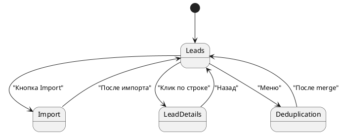

# Экраны MVP

Выбраны 4 экрана, потому что они напрямую покрывают ключевые use cases: импорт, работа с базой, enrichment, ручная правка и merge дублей.

## Список экранов

| Экран | Route | Назначение |
|---|---|---|
| Leads | `/leads` | Главная рабочая таблица лидов, фильтры, запуск enrichment и export |
| Import | `/imports/new` | Импорт CSV или Google Sheets, preview, mapping, запуск импорта |
| Lead Details / Enrichment Review | `/leads/{leadId}` | Просмотр лида, AI лог, ручная правка после needs_review |
| Deduplication | `/deduplication` | Просмотр групп дублей и merge |

## Переходы между экранами

## Экран 1. Leads (`/leads`)

Главный рабочий экран. Пользователь ищет и фильтрует лидов, выбирает записи чекбоксами, запускает enrichment / export, открывает карточку лида.

**Основные элементы:**
- Поиск по имени / email / компании
- Фильтры: статус, источник, теги, "needs review"
- Таблица с пагинацией (50 строк по умолчанию)
- Выбор лидов чекбоксами
- Кнопки: Enrich with AI, Export to Instantly CSV, Delete
- Сортировка по любой колонке

> **TODO:** прикрепить экспортированный wireframe из draw.io. Файл `screen_1_leads.drawio` в `/diagrams/`.

## Экран 2. Import (`/imports/new`)

Пользователь выбирает источник, получает preview, сопоставляет колонки и запускает импорт.

**Основные элементы:**
- Переключатель источника: CSV / Google Sheets
- Загрузка файла или вставка ссылки на таблицу
- Preview первых 5 строк
- Mapping: каждая колонка источника → поле системы
- Кнопка Import
- Прогресс импорта

> **TODO:** прикрепить wireframe `screen_2_import.drawio`.

## Экран 3. Lead Details / Enrichment Review (`/leads/{leadId}`)

Экран для сценария human-in-the-loop. Пользователь видит результат AI, причину review и правит поля вручную.

**Основные элементы:**
- Все поля лида (редактируемые inline)
- Блок AI Enrichment Log: промпт, ответ AI, дата, причина review
- Кнопка "Re-enrich" с выбором другого шаблона
- История изменений (audit log)

> **TODO:** прикрепить wireframe `screen_3_lead_details.drawio`.

## Экран 4. Deduplication (`/deduplication`)

Группы дублей, сравнение полей и ручной выбор master-записи для merge.

**Основные элементы:**
- Список групп дублей с confidence score
- Открытие группы — таблица сравнения полей (что совпадает / отличается выделено цветом)
- Радио-кнопка: выбрать master
- Кнопка Merge

> **TODO:** прикрепить wireframe `screen_4_deduplication.drawio`.

## Источники данных (endpoints) для экранов

| Экран / действие | Endpoint | Метод |
|---|---|---|
| Leads: поиск / фильтры / сортировка | `/tenants/{tenantId}/leads/search` | POST |
| Leads: Enrich with AI | `/tenants/{tenantId}/enrichment/jobs` | POST |
| Leads: polling статуса enrichment | `/tenants/{tenantId}/enrichment/jobs/{jobId}` | GET |
| Leads: Export to Instantly CSV | `/tenants/{tenantId}/exports/instantly` | POST |
| Leads: загрузка значений фильтров | `/tenants/{tenantId}/leads/filters` | GET |
| Import: preview CSV | `/tenants/{tenantId}/imports/csv/preview` | POST |
| Import: start CSV import | `/tenants/{tenantId}/imports/csv/execute` | POST |
| Import: preview Google Sheets | `/tenants/{tenantId}/imports/google-sheets/preview` | POST |
| Import: start Google Sheets | `/tenants/{tenantId}/imports/google-sheets/execute` | POST |
| Import: report | `/tenants/{tenantId}/imports/{importId}` | GET |
| Lead Details: карточка | `/tenants/{tenantId}/leads/{leadId}` | GET |
| Lead Details: AI log | `/tenants/{tenantId}/enrichment/logs/{logId}` | GET |
| Lead Details: ручные правки | `/tenants/{tenantId}/leads/{leadId}` | PATCH |
| Deduplication: список групп | `/tenants/{tenantId}/deduplication/groups` | GET |
| Deduplication: детали группы | `/tenants/{tenantId}/deduplication/groups/{groupId}` | GET |
| Deduplication: merge | `/tenants/{tenantId}/deduplication/groups/{groupId}/merge` | POST |

Полная OpenAPI-спецификация доступна в разделе [API](../06-api/api-overview).
